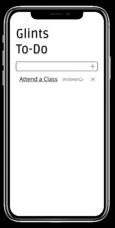
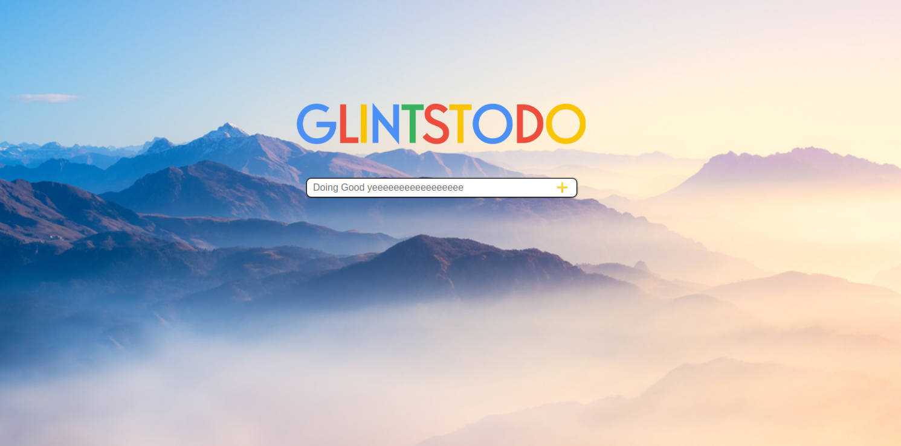
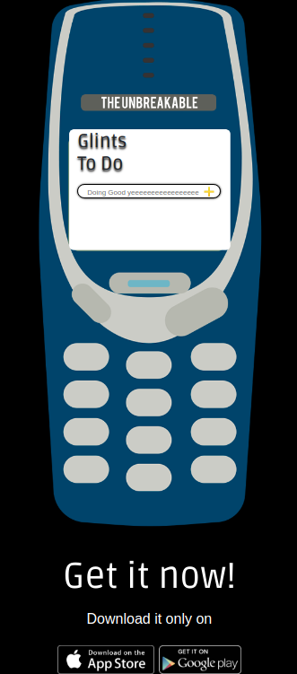

# Glints To-Do

### Mobile Mockup

### Web Mockup

This file is a documentation of Glints To-Do App, A simple app that make your life easier by schedule your activities faster and simple

## Live Preview
 - Figma Mobile Mockup [Here](https://www.figma.com/file/fFly3zWjaRFoFIMwVckHq3Cb/Glints-To-Do) 
 - Figma Web Mockup [Here](https://www.figma.com/proto/Sj4vqeVF5nWsxIg7CtfVb2cH/GlintsTodoWEB)
 - Github Pages [Here](https://abbayosua.github.io/glintstodo/)
- Algorythm [Here](https://www.figma.com/file/F3ZRrJrSkv7fOAz7R8vz7zSO/Glints-To-do-Flowchart?node-id=0%3A1)

## Feature

- Makes Your Time Organized
- Makes Your Life Easier
- Can Make Your Time Freeier
- Makes You Not Getting Late Anymore

## Disadvantage

- Doesn't Work When you Not Discipline
- Doesn't Work When you Procrastinate
- Doesn't Work When you Don't Give any S*it of it

## *Future Updates*

- Will Added Electric Shock (Connected with a Wrist Band) When the Time only left 5 Minutes
- Will Added Metalica Alarm Sound
- Time Machine Module, When Some Activities is Skipped up (Time Travel Machine)

***Easter Egg***

